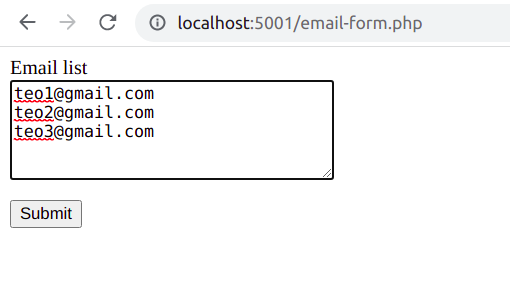
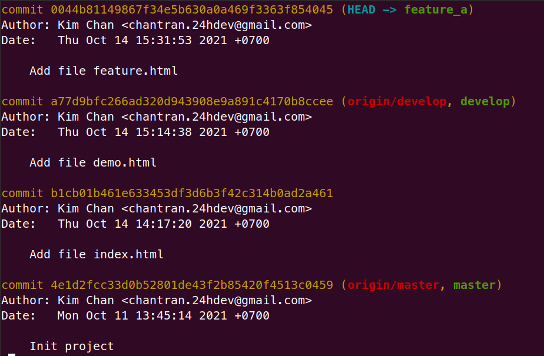
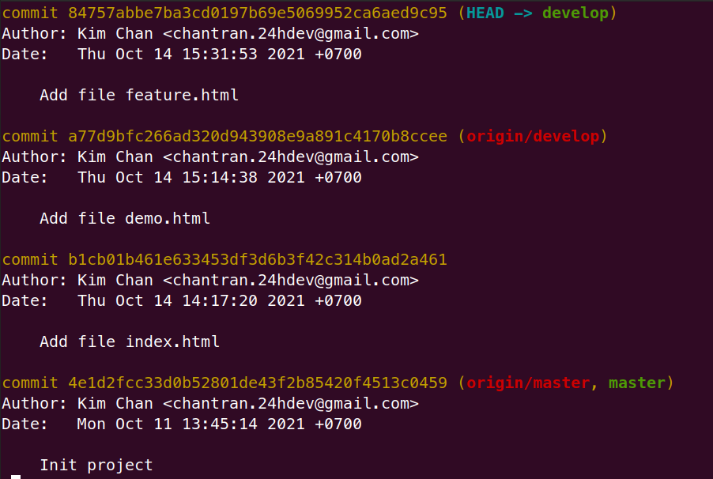

# Bài 1 - User, group, file permission, ssh

**AGENDA**

1. Add new user, group
2. Add user into a group
3. File permission
4. Upload file to server
5. Download file from server
6. Config ssh, using public key and private key

## 1. Add new user, group

- Tạo 3 user: `kctrA`, `kctrB`, `kctrC` và set password

```bash
sudo useradd -m -c 'Kim Chan A' kctrA
sudo passwd kctrA

sudo useradd -m -c 'Kim Chan B' kctrB
sudo passwd kctrB

sudo useradd -m -c 'Kim Chan C' kctrC
sudo passwd kctrC
```

- Tạo 2 group: `group_1` and `group_2`

```bash
sudo groupadd group_1
sudo groupadd group_2
```

## 2. Add user into a group

- Cho `kctrA`, `kctrB` vào `group_1`
- Cho `kctrC` vào `group_2`

```bash
sudo usermod -g group_1 kctrA
sudo usermod -g group_1 kctrB

sudo usermod -g group_2 kctrC
```

> Result:


## 3. File permission

- Tạo file example.txt

```bash
# Move to Desktop folder
cd ~/Desktop

# Create a new file
touch example.txt
```

```bash
# Check file permissions
ls -l
```


- Changing ownership and group of `example.txt` to `kctrA`, `group_2`

```bash
sudo chown kctrA:group_2 example.txt
```


- Changing `example.txt` file permissions
  - kctrA can `read`, `write`, `execute` --> rwx (7)
  - group_2 can `read`, `execute` --> r-x (5)
  - others can `read` --> r- (4)

```bash
sudo chmod 754 example.txt
```

> Result



## 4. Upload file to server

- Connect server


- Management config SSH


- Upload `kimchan-upload.txt` to server (/home/ubuntu/k8)

```bash
scp kimchan-upload.txt ubuntu:/home/ubuntu/k8/
```



## 5. Download file from server

```bash
scp ubuntu:/home/ubuntu/k8/download-test.txt mine.txt
```



## 6. Config ssh, using public key and private key

- Generate SSH key and copy `public key`

```bash
cat ~/.ssh/id_rsa.pub
```

- Paste `public key` to to SSH server (/home/ubuntu/.ssh/authorized_keys)

- Config `private key` for SSH client


> Result
> 
