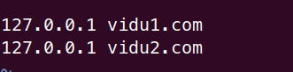
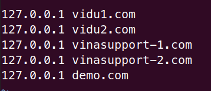
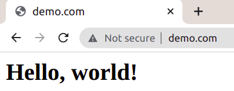
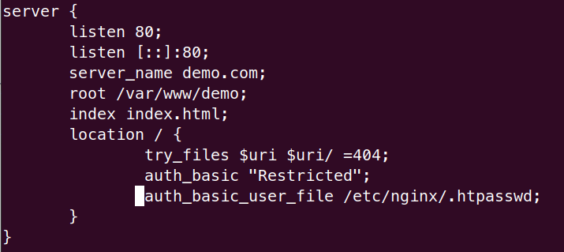
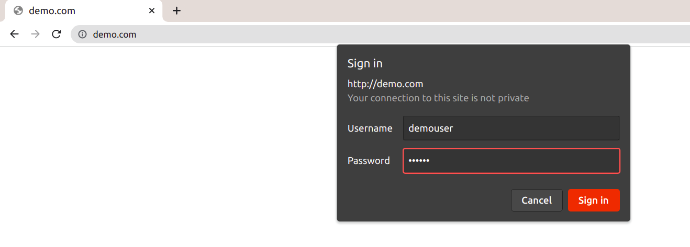
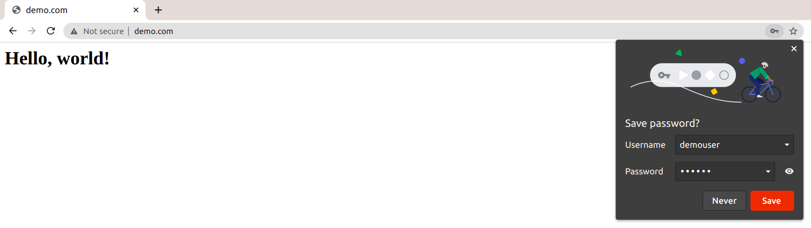

# Bài 2 - Virtual host, server block Apache, Nginx

**AGENDA**

1. Cài đặt apache, nginx
2. Tạo virtual host trên apache chạy nhiều web
3. Tạo virtual host trên nginx chạy nhiều web
4. Làm một virtual host ở máy
5. Tạo 1 authenticate basic khi vào trang
6. (optional) Tạo ssl cho web server với nginx

## 1. Cài đặt apache, nginx

> Result


## 2. Tạo virtual host trên apache chạy nhiều web

- B1. Tạo thư mục cho trang web

```bash
sudo mkdir -p /var/www/vidu1.com/public_html
sudo mkdir -p /var/www/vidu2.com/public_html
```

- B2. Tạo tập tin cấu hình virtual host

Kiểm tra các virtual host có sẵn

```bash
ls -l /etc/apache2/sites-available
```


Sao chép 2 virtual host mặc định cho hai tên miền mới

```bash
sudo cp /etc/apache2/sites-available/000-default.conf /etc/apache2/sites-available/vidu1.com.conf
sudo cp /etc/apache2/sites-available/000-default.conf /etc/apache2/sites-available/vidu2.com.conf
```


Mở và chỉnh sửa tập tin cấu hình `vidu1.com.conf`, `vidu2.com.conf`

```
ServerName vidu1.com
ServerAlias www.vidu1.com

ServerAdmin webmaster@vidu1.com
DocumentRoot /var/www/vidu1.com/public_html
```

```
ServerName vidu2.com
ServerAlias www.vidu2.com

ServerAdmin webmaster@vidu2.com
DocumentRoot /var/www/vidu2.com/public_html
```

- B3. Bật virtual host để các cấu hình hoạt động

```bash
sudo a2ensite vidu1.com.conf
sudo a2ensite vidu2.com.conf
```

Config `/etc/hosts`



Khởi động lại máy chủ web Apache

```bash
sudo service apache2 restart
```


- B4. Kiểm tra xem việc tạo virtual host trên Apache đã đúng chưa

Tạo file `index.html` ở `/var/www/vidu1.com/public_html` với nội dung


Tạo file `index.html` ở `/var/www/vidu2.com/public_html` với nội dung


> Result


## 3. Tạo virtual host trên nginx chạy nhiều web

- B1. Tạo thư mục cho trang web

```bash
sudo mkdir -p /var/www/vinasupport_{1,2}
```

- B2. Tạo 2 file `index.html` cho 2 website `vinasupport-1` và `vinasupport-2`

```bash
sudo vim /var/www/vinasupport_1/index.html
```

```
<html>
 <head>
 <title>vinasupport1.com</title>
 </head>
 <body>
   <p>Website: vinasupport-1.com</p>
 </body>
</html>
```

```bash
sudo vim /var/www/vinasupport_2/index.html
```

```
<html>
 <head>
 <title>vinasupport2.com</title>
 </head>
 <body>
   <p>Website: vinasupport-2.com</p>
 </body>
</html>
```

- B3. Tạo tập tin cấu hình virtual host

```bash
sudo vim /etc/nginx/sites-available/vinasupport-1.conf
```

```
server {
       listen 80;
       listen [::]:80;
       server_name vinasupport-1.com;
       root /var/www/vinasupport_1;
       index index.html;
       location / {
               try_files $uri $uri/ =404;
       }
}
```

```bash
sudo vim /etc/nginx/sites-available/vinasupport-2.conf
```

```
server {
       listen 80;
       listen [::]:80;
       server_name vinasupport-2.com;
       root /var/www/vinasupport_2;
       index index.html;
       location / {
               try_files $uri $uri/ =404;
       }
}
```

- B4. Tạo 2 file symbolic link tới thư mục /etc/nginx/sites-enabled/

```bash
sudo ln -s /etc/nginx/sites-available/vinasupport-1.conf /etc/nginx/sites-enabled/vinasupport-1.conf
sudo ln -s /etc/nginx/sites-available/vinasupport-2.conf /etc/nginx/sites-enabled/vinasupport-2.conf
```

- B5. Config `/etc/hosts` và khởi động service nginx


```bash title='start service nginx'
sudo service nginx start
```

- B6. Reload lại service của Nginx Web Server để nhận 2 file configs

```bash
sudo systemctl reload nginx
```

> Result


## 4. Làm một virtual host ở máy

- B1. Tạo thư mục cho trang web

```bash
sudo mkdir -p /var/www/demo
```

- B2. Tạo file `index.html` cho website `demo`

```bash
sudo vim /var/www/demo/index.html
```

```
<html>
 <head>
 <title>demo.com</title>
 </head>
 <body>
   <h1>Hello, world!</h1>
 </body>
</html>
```

- B3. Tạo tập tin cấu hình virtual host

```bash
sudo vim /etc/nginx/sites-available/demo.conf
```

```
server {
       listen 80;
       listen [::]:80;
       server_name demo.com;
       root /var/www/demo;
       index index.html;
       location / {
               try_files $uri $uri/ =404;
       }
}
```

- B4. Tạo file symbolic link tới thư mục /etc/nginx/sites-enabled/

```bash
sudo ln -s /etc/nginx/sites-available/demo.conf /etc/nginx/sites-enabled/demo.conf
```

- B5. Config `/etc/hosts`



- B6. Reload lại service của Nginx Web Server để nhận 2 file configs

```bash
sudo systemctl reload nginx
```

> Result



## 5. Tạo 1 authenticate basic khi vào trang

- B1. Tạo user và password


- B2. Cập nhật file nginx config `/etc/nginx/sites-available/demo.conf`



- B3. Reload lại service của Nginx

```bash
sudo systemctl reload nginx
```

> Result





## 6. (optional) Tạo ssl cho web server với nginx
- Chưa làm được 😢
