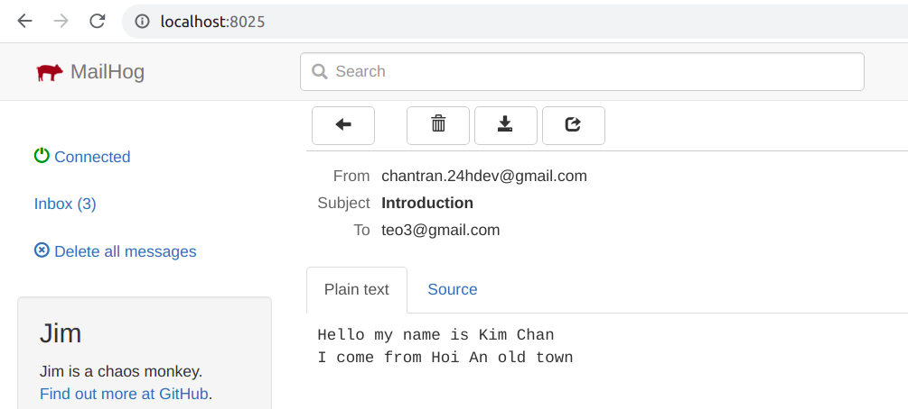
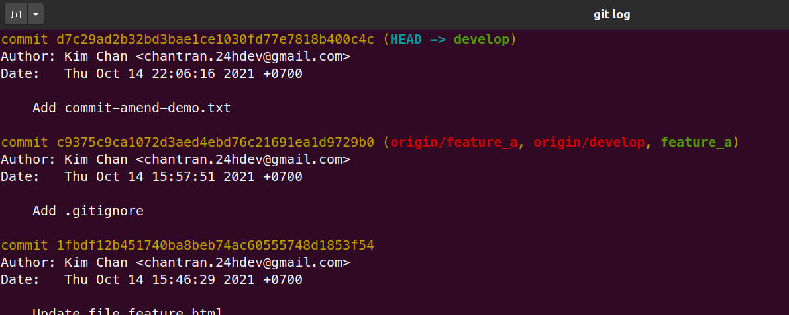
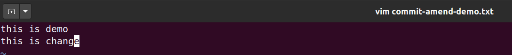
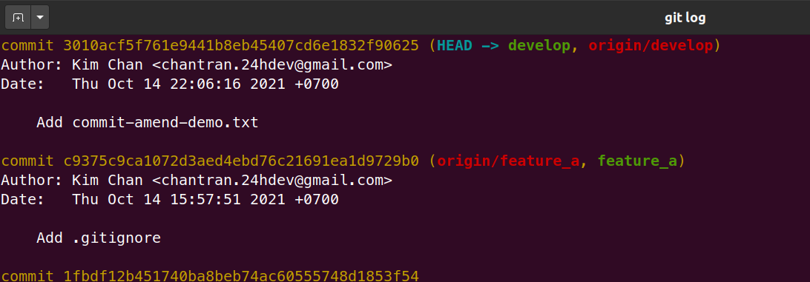

# Git

## 1. Git config local username and email

```bash
git config user.name "Kim Chan"
git config user.email "chantran.24hdev@gmail.com"
```

## 2. Checkout master 1 branch là develop

```bash
# chắc chắn đang ở nhánh master
git checkout master

# tạo nhánh develop và checkout nhánh develop
git checkout -b develop
```

## 3. Tạo file trên nhánh develop, sử dụng .gitignore, commit add file

- Tạo 3 file `demo.log`, `index.html`, `.gitignore`

```bash
touch demo.log index.html .gitignore
```

- Nội dung của file `.gitignore`

```
*.log
```

- Nội dung của file `index.html`

```html
<!DOCTYPE html>
<html lang="en">
  <head>
    <meta charset="UTF-8" />
    <meta http-equiv="X-UA-Compatible" content="IE=edge" />
    <meta name="viewport" content="width=device-width, initial-scale=1.0" />
    <title>Document</title>
  </head>
  <body>
    <h1>Hello world</h1>
  </body>
</html>
```

- Tạo commit add file `index.html`

```bash
git add index.html
git commit -m 'Add file index.html'
```

## 4. Sửa đổi nội dung trên file index.html và revert lại sử dụng git

- Sửa đổi nội dung file `index.html`


- Revert lại file `index.html`

```bash
# kiểm tra các file mới, đã thay đổi
git status
```


```bash
git restore index.html
```

> Result

```bash
# kiểm tra lại, sẽ không thấy sự thay đổi của file index.html
git status
```


## 5. Tạo file, commit add file, push code lên origin

```bash
# tạo file demo.html in ra dòng chữ "This is file demo"
vim demo.html
```


```bash
# add và commit file demo.html

git add demo.html
git commit -m 'Add file demo.html'
```

```bash
# push nhánh develop lên origin
# vì push lần đầu tiên nên phải sử dụng -u

git push -u origin develop
```

## 6. Làm việc với git reset

```bash
# Show các commit
git log
```


```bash
git reset HEAD~1
```

```bash
# Show các commit sau khi git reset
git log
```


```bash
# Sửa đổi file demo.html
vim demo.html
```



```bash
git add demo.html
git commit -m 'Add file demo.html'

# ghi đè nhánh develop ở remote
git push -f origin develop
```

### Sử dụng `git commit --amend`

```bash
# checkout sang nhánh develop và tạo file mới commit-amend-demo.txt
git checkout develop
vim commit-amend-demo.txt

# add và commit file mới
git add commit-amend-demo.txt
git commit -m 'Add commit-amend-demo.txt'
```



- Thay đổi nội dung file `commit-amend-demo.txt`



- Sử dụng `git commit --amend`

```bash
git add commit-amend-demo.txt
git commit --amend
```

> Result




## 7. Làm việc với cherry-pick

```bash
# taọ và checkout nhánh feature_a
git checkout -b feature_a

# tạo file feature.html với nội dung
vim feature.html
```

```html
<!DOCTYPE html>
<html lang="en">
  <head>
    <meta charset="UTF-8" />
    <meta http-equiv="X-UA-Compatible" content="IE=edge" />
    <meta name="viewport" content="width=device-width, initial-scale=1.0" />
    <title>Document</title>
  </head>
  <body>
    <h1>This is feature.html file</h1>
  </body>
</html>
```

```bash
# add và commit file feature.html

git add feature.html
git commit -m 'Add file feature.html'

# xem các commit của nhánh feature_a
git log
```


```bash
# checkout nhánh develop
git checkout develop

# thêm commit có id: 0044b81149867f34e5b630a0a469f3363f854045 vào nhánh develop
git cherry-pick 0044b81149867f34e5b630a0a469f3363f854045

# xem các commit của nhánh develop
git log
```


## 8. Làm việc với git rebase

- Thay đổi nội dung file `feature.html`

```html
<!DOCTYPE html>
<html lang="en">
  <head>
    <meta charset="UTF-8" />
    <meta http-equiv="X-UA-Compatible" content="IE=edge" />
    <meta name="viewport" content="width=device-width, initial-scale=1.0" />
    <title>Document</title>
  </head>
  <body>
    <h1>This is feature.html file</h1>
    <p>This is the change</p>
  </body>
</html>
```

```bash
# cập nhật thay đổi và commit

git add feature.html
git commit -m 'Update file feature.html'
```

```bash
# checkout sang nhánh feature_a
git checkout feature_a

# git rebase với nhánh develop
git rebase develop
```

> Result


