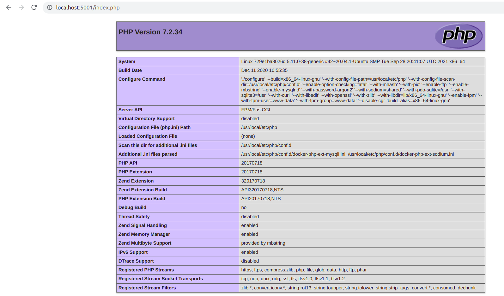
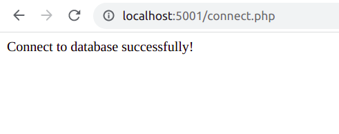
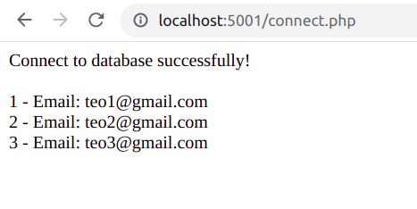
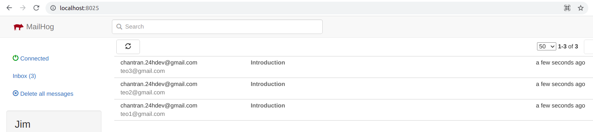

# K8 - Training Docker

## Question 1

1. Build `demo-php` image from `php.dockerfile`

```bash
sudo docker build -f php.dockerfile -t demo-php .
```

`php.dockerfile`

```
FROM php:7.2-fpm

RUN cd /var/www
COPY ./src /var/www/docker-demo
```

2. Build `demo-nginx` image from `Dockerfile`

```bash
sudo docker build -t demo-nginx .
```

3. Run `demo-php` container

```bash
sudo docker run --name container-demo-php demo-php
```

4. Run `demo-nginx` container with `demo-php` container

```bash
sudo docker run -dp 3001:80 --link container-demo-php:php demo-nginx
```

> Go to http://localhost:3001


## Question 2

```bash
docker-compose up
```

> Go to http://localhost:5001/index.php



## Question 3

> Go to http://localhost:5001/connect.php



## Question 4

> Go to http://localhost:5001/email-form.php

Enter email list


Result



MailHog


